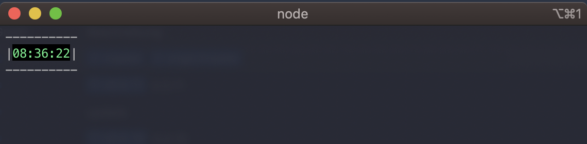

# whatime

A simple npm package which gives you the current time - lovely formatted.



## Install

```sh
npm i -g whatime
```

## Usage

```sh
Usage: whatime [options]

A simple npm package which gives you the current time - lovely formatted.

Options:
  -V, --version  output the version number
  -h, --help     output usage information
```